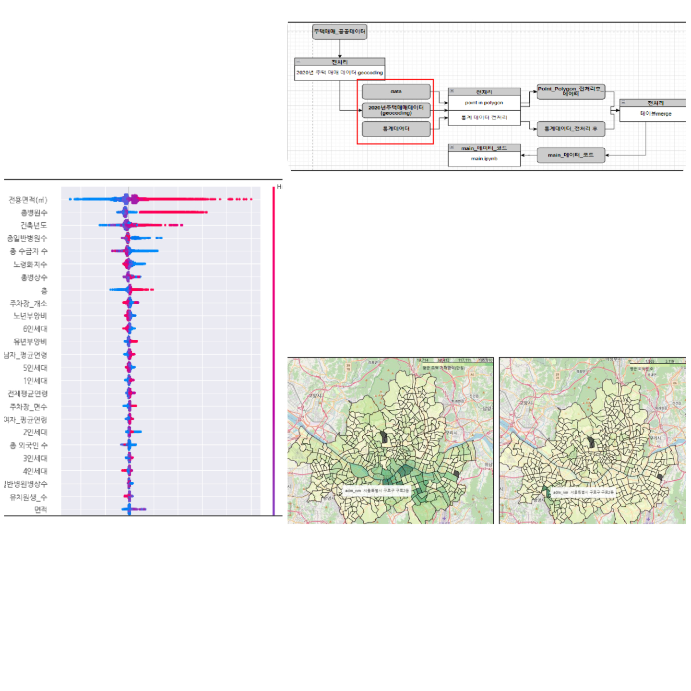
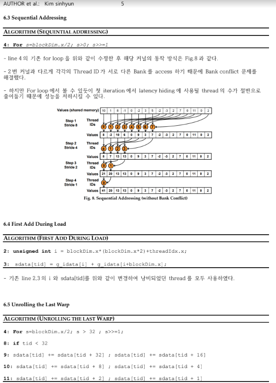
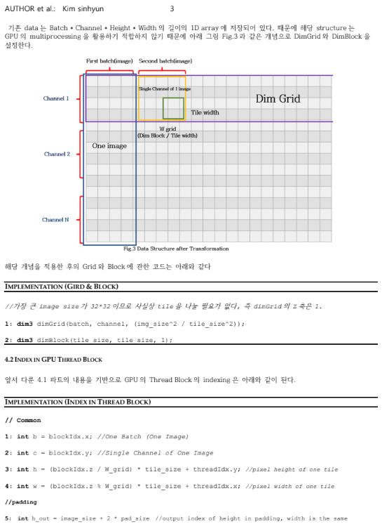
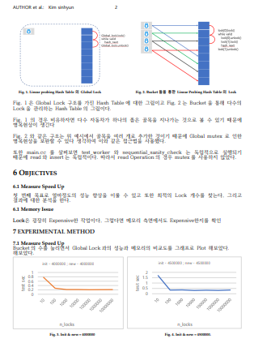
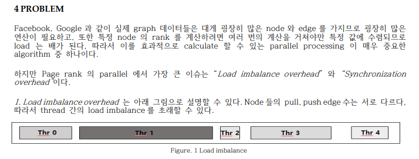
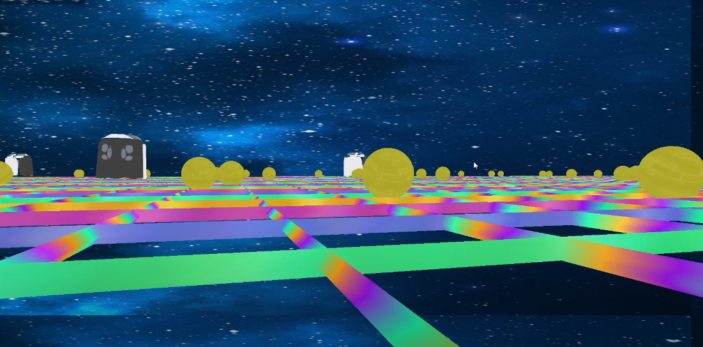

# 🙋🏻‍♂️ 데이터 엔지니어를 꿈꾸는 주니어 개발자입니다 🙋🏻‍♂️

# ✏️ Personal Info

- Name: Kim sinhyun 김신현
- University: Yonsei University (TSU)
- Email: ksh415622@yonsei.ac.kr

# 🛠 Tech Stacks

- Language : 
  
  
  
  
  

- Framework : 
  
  

- Libarary: 
  
  
  
  
  
  
  
  
  
  
  
  
  
- Machine Learning: 
  
  
  
  
- Deep Learning: 
  

- Database :
  
  
  
- Version Control :
  
  
 - CI/CD:
  
  
 - Publisher:
  
   

# :arrow_upper_right: What to learn
  - Big Data Architecture:
  
  
  
  

# 💻 Representative Projects
1. **Machine Learning** 
    - 서울 집값에 영향을 미치는 숨겨진 요인을 찾아서
        - c
        - Source Code: https://github.com/kimsinhyun/What-factors-affect-house-prices-in-Seoul-.git
        
2.  **C++ CUDA Programing**:
    1. C++ CUDA Parallel Reduction Sum
      - c
      - Source Code: https://github.com/kimsinhyun/MultiCore_GPU_Programing/tree/hw6
      - Report: https://drive.google.com/file/d/1PboSiaiVV09v0By1DKGIQAiLXO9aoLP0/view?usp=sharing
    2. C++ CUDA Implement "VGG16" CNN Model
      - c
      - Source Code: https://github.com/kimsinhyun/MultiCore_GPU_Programing/tree/hw7
      - Report: https://drive.google.com/file/d/1JfLWcHVny5alB8gqregZJe8QZRZvIRAe/view?usp=sharing

3.  **C++ Multi Core Programing**
    1. Optimize Multi Core Porbing Hash Table  
      - c
      - Source Code: https://github.com/kimsinhyun/MultiCore_GPU_Programing/tree/hw2
      - Report: https://drive.google.com/file/d/1ZkeAsSE2uaLk5c2wJe-xpJWZU-1hC2dE/view?usp=sharing  
    2. Advanced Parallel Page Rank Algorithm with OpenMP 
      - c
      - Source Code: https://github.com/kimsinhyun/MultiCore_GPU_Programing/tree/hw2
      - Report: https://drive.google.com/file/d/1q32UAF6z1g3XSCj7sfrx4zYGldo2RYt-/view?usp=sharing
      
4. **JAVA Implement mini C Compiler**
    1. Scanner
      - Source Code: https://github.com/kimsinhyun/Compiler_Design_Scanner
    2. Parser
      - Source Code: https://github.com/kimsinhyun/Compiler_Design_Parser
    3. AST Generator
      - Source Code: https://github.com/kimsinhyun/Compiler_Design_AST_Generator
    4. Static Semantic Analyser
      - Source Code: https://github.com/kimsinhyun/Compiler_Design_Semantic_Analysis
    5. Code Generator
      - Source Code: https://github.com/kimsinhyun/Compiler_Design_Code_Generator
      
5. **C++ OpenGL Simple 3D Pac-Man**
      - 
      - Source Code: https://github.com/kimsinhyun/opengl_finalPJ
   
6.  **Computer Vision**
    1.  Implementing 3 Filters & Fourier Transform with NumPy
      - Source Code: https://github.com/kimsinhyun/computerVision_HW
    2.  Implementing eigenface(svd) with NumPy
      - Source Code: https://github.com/kimsinhyun/computerVision_HW/tree/project2_ver2
    3.  Implement ResNet with PyTorch
      - Source Code: https://github.com/kimsinhyun/computerVision_HW/tree/hw3
